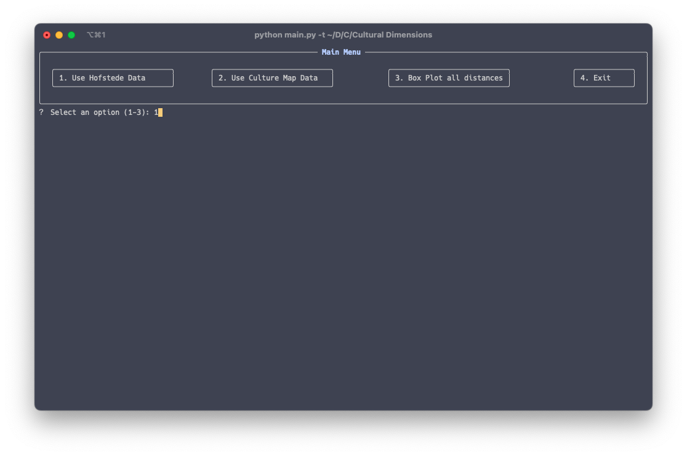
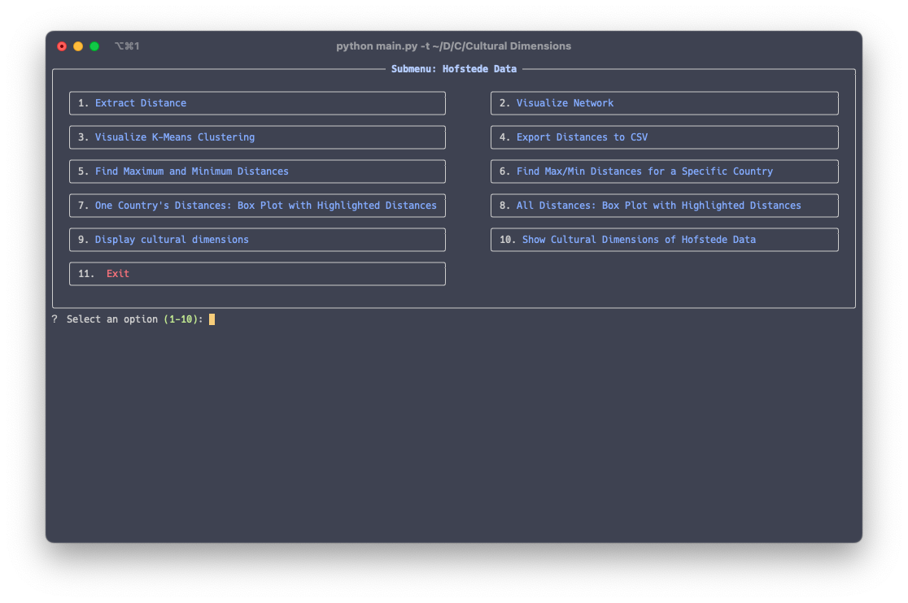
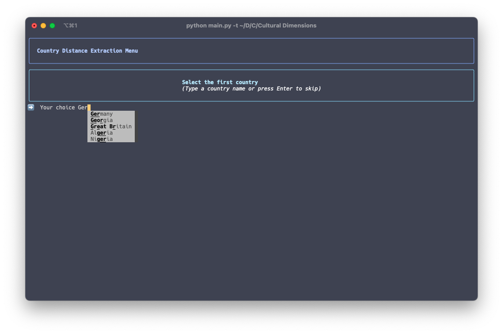

<!-- ⚠️ This README has been generated from the file(s) "blueprint.md" ⚠️-->
[](#cultural-distances-project-overview)

# ➤ Cultural Distances: Project Overview

This repository contains Python scripts and associated files for processing, analyzing, and visualizing cultural data. The project uses various Python libraries for data manipulation and machine learning.

[](#how-to-use)

## ➤ How to Install

> [!NOTE]  
>    Make sure you have Python installed (version >= 3.8): https://www.python.org/

1. **Clone the Repository**

   ```bash
   git clone https://github.com/felsenuboot/Cultural_Distances.git
   cd Cultural_Distances
   ```

2. _(Optional)_ **Create a virtual environment**
   Mac:
   ```bash
   python3 -m venv .venv
   source .venv/bin/activate
   ```

   Windows
   ```cmd
   python3 -m venv .venv
   C:\> .venv\Scripts\activate.bat
   ```
   
2. **Install Dependencies**

   ```bash
   pip install -r requirements.txt
   ```

3. **Run the Scripts**
   ```bash
   python main.py -t -s
   ```
   ```-t``` is the flag for commandline mode, it needs to be added.
   ```-s``` is the flag for immediate display of figures generated, figures will be saves in ```./figures``` regardless.

## ➤ How to Use
When in the script, you will be presented with a menu to select the udnerlying data for further caluclations and visualisations. Select the menus by typing in the corresponding number and pressing ```enter```.

Within the submenu you can choose from various ways to anaylze, explore and display the data.

When needing to select a country, there is an autocomplete feature. Just type the first letters of a country and it will suggest completions. Select the completion with the arrow keys and press enter.



[](#files-in-this-repository)

## ➤ Files in This Repository

#### 1. `convert_data.py`

This script contains functions to process raw data, transform it into a usable format, and prepare it for analysis or visualization. The script likely handles tasks such as:

- Data cleaning
- Format conversions
- Data validation

#### 2. `main.py`

This script serves as the entry point for the project. 

- Running analysis or model training pipelines
- Generating visualizations or reports based on processed data
```bash
python main.py -t    #will start the application in terminal mode
python main.py -t -s #will start the application in terminal mode and display generated figures right away
```

#### 3. `functions.py`

This script contains the majority of calculation and visualization functions.

#### 4. `terminal.py`

This script serves as the terminal interface.

#### 5. `requirements.txt`

This file lists all the Python dependencies required to run the project. Use it to install the necessary libraries with the following command:

```bash
pip install -r requirements.txt
```


[](#notes)

## ➤ Notes

- Ensure your input data meets the expected format required by `convert_data.py`. Check the script for details on input and output specifications.
- If any issues arise, ensure all dependencies are installed and compatible with your Python version.


[](#contributing)

## ➤ Contributing

Feel free to contribute by submitting pull requests. Make sure to:

- Document any new functions or features.
- Test your changes thoroughly.
