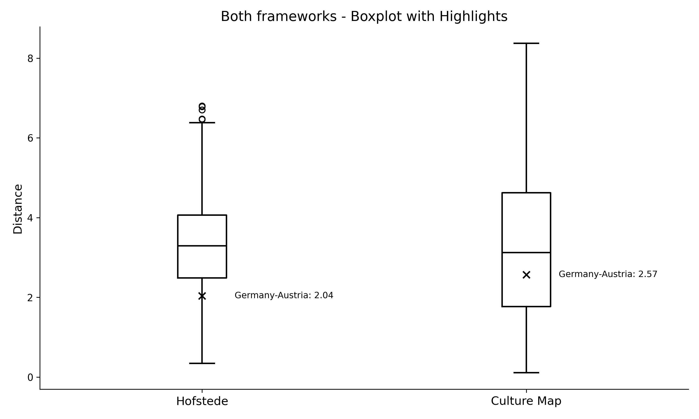
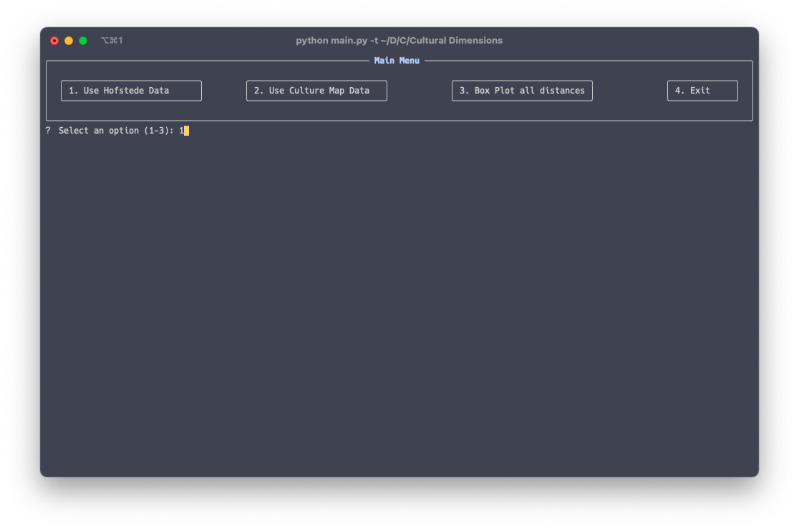
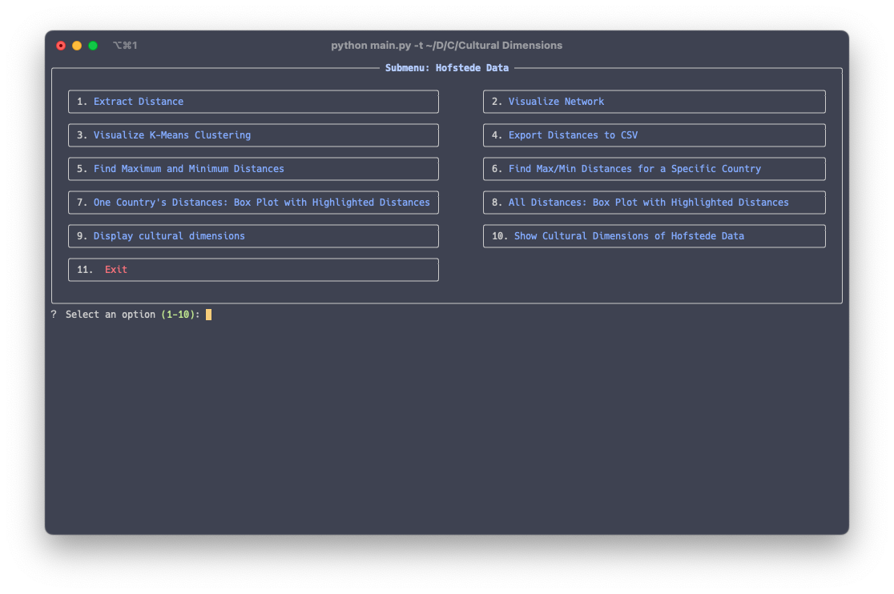
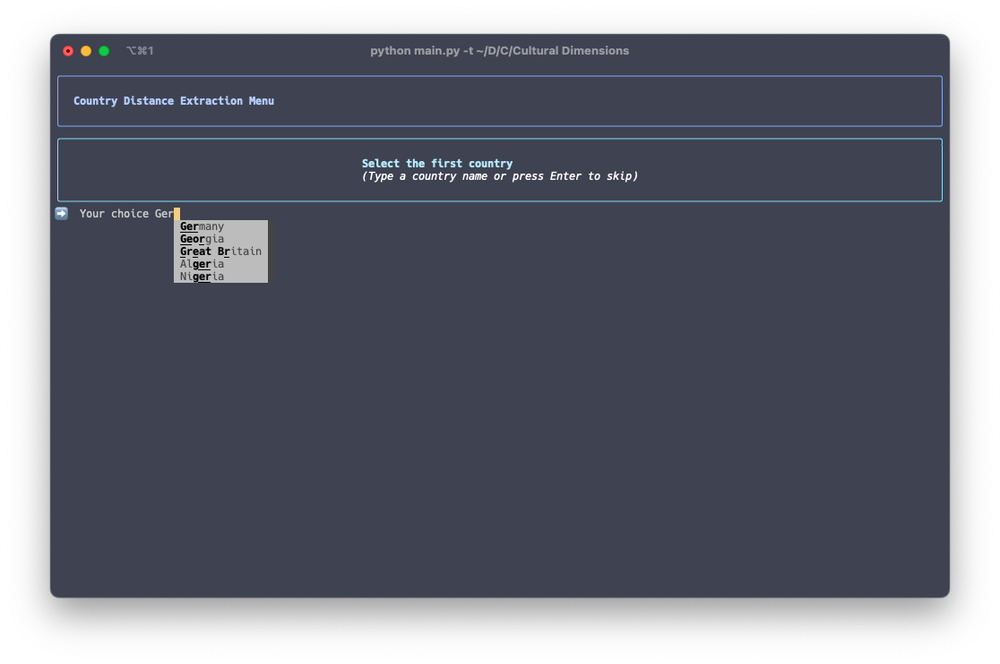

<div align="center">
  
  <h1>Cultural Distances</h1>
  <p>How far apart are two countries, culturally? Hofstede and the Culture Map, measured</p>
</div>

Cultural Distances is a terminal tool that turns two cultural dimension
models into numbers you can compare: Geert Hofstede's six dimensions and
Erin Meyer's eight Culture Map scales. It computes a distance between every
pair of countries in each framework, then lets you look at the result as a
network graph, as clusters, as box plots with the pairs you care about
highlighted, or as a CSV. Python, pandas, scikit-learn and matplotlib, with a
menu built on rich and prompt_toolkit.

It was written for my master's thesis at Philipps-Universität Marburg
(*The Effect of Cultural Distance on Overpayment in Cross-Border M&A: A
Comparative Analysis through German and Japanese Case Studies*, 2024), where
the distances between acquirer and target countries were one of the inputs.

<p align="center">
  
</p>

> [!NOTE]
> A research tool: it does what the thesis needed and not much more, and the
> country lists are those of the two datasets. No warranty; not affiliated
> with Hofstede Insights or with Erin Meyer.

## Features

- 📏 **Distances.** The standardised Euclidean distance between every pair
  of countries, each dimension scaled by its variance so no single scale
  dominates; look one pair up, or export the whole matrix as CSV.
- 🕸️ **Network graph.** The countries as nodes, distances as edges, for a
  selection or for all.
- 🧩 **Clusters.** K-means over the distance matrix, drawn in two dimensions
  by MDS or by t-SNE, with chosen countries highlighted.
- 📦 **Box plots.** The distribution of all distances, or of one country's
  distances to everyone else, with named pairs marked on it; and one figure
  with both frameworks side by side.
- 🔎 **Extremes.** The most and least distant pairs overall, or for one
  country.
- 📋 **Dimension tables.** The raw scores of a set of countries as a table,
  copied to the clipboard so it pastes into Word as a table.
- ⌨️ **Autocomplete.** Type the first letters of a country and pick the
  completion with the arrow keys.

<p align="center">
  
</p>

## Install

Python 3.8 or newer.

```
git clone https://github.com/felsenuboot/Cultural_Distances.git
cd Cultural_Distances
python -m venv .venv && source .venv/bin/activate   # .venv\Scripts\activate.bat on Windows
pip install -r requirements.txt
python main.py -t -s
```

`-t` starts the terminal interface (it is the only mode, and the flag is
required). `-s` shows each figure as it is generated; with or without it,
every figure is saved to `figures/`.

`requirements.txt` is a frozen environment and pulls in more than the tool
needs. The actual dependencies are pandas, numpy, scipy, scikit-learn,
networkx, matplotlib, seaborn, rich, prompt_toolkit, pyperclip and tabulate.

## Use

The main menu picks the framework, or the combined box plot of both:



The submenu has the analyses listed above for that framework:



Wherever a country is asked for, the prompt completes it:



## The data

| File | Contents |
| --- | --- |
| `data/hofstede_data.json` | Hofstede's six dimensions per country: power distance (`pdi`), individualism (`idv`), motivation towards achievement (`mas`), uncertainty avoidance (`uai`), long-term orientation (`ltowvs`), indulgence (`ivr`). Regions such as "Africa East" are included as the source lists them. |
| `data/culture_map_data.json` | The eight Culture Map scales per country: communicating, evaluating, leading, deciding, trusting, disagreeing, scheduling, persuading. |
| `data/*_distances.csv` | The computed distance matrices, as exported by the tool. |

A score of `-1` means the source has no value; a dimension with a missing
value in any country is dropped before the distances are computed, so the
two frameworks are each compared on complete columns only.

The Hofstede scores are those published by Hofstede Insights; the Culture
Map positions are Erin Meyer's, from *The Culture Map* (2014). Both remain
the property of their authors; this repository only carries them for the
analysis.

## Files

| File | Role |
| --- | --- |
| `main.py` | Entry point, the main menu, the combined box plot |
| `terminal.py` | The per-framework submenu and the country selection prompts |
| `functions.py` | Distances, graphs, clusters, box plots, tables and the CSV export |
| `convert_data.py` | Turns the raw source data into the JSON files in `data/` |
